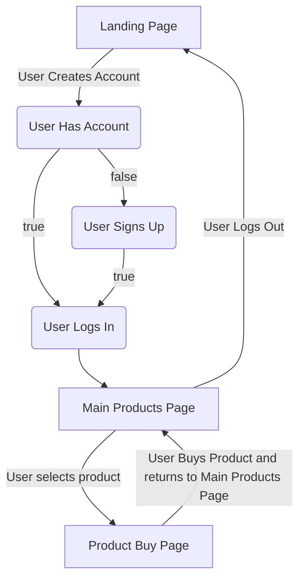

# module-4-mermaid-demo

```mermaid
graph TD
  A[Landing Page] --> | User Creates Account| B(User Has Account)
  B -->|true| C(User Logs In)
    B -->|false| D(User Signs Up)
    D -->|true| C
    C --> E[Main Products Page]
    E -->|User selects product| F[Product Buy Page]
    F -->|User Buys Product and returns to Main Products Page| E
    E -->|User Logs Out| A
```